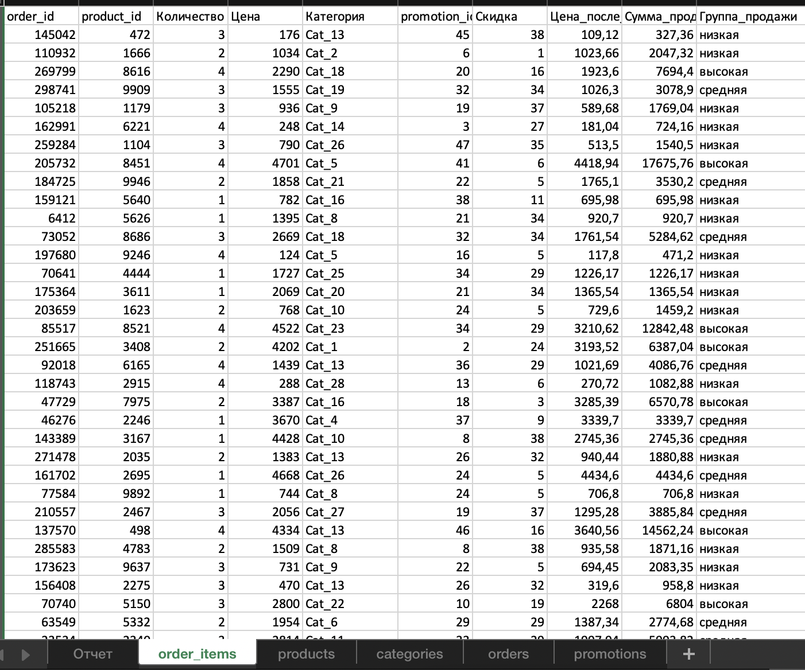
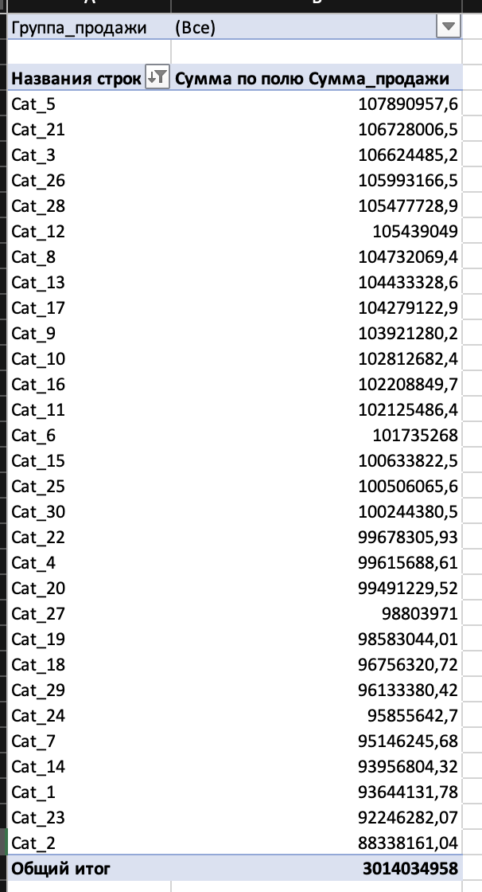

# Анализ продаж в Excel

## Цель проекта

Подготовить удобный Excel-файл для менеджеров на основе нескольких таблиц с данными о продажах, товарах, категориях, заказах и промоакциях.

## Что было сделано

* Объединены данные из таблиц `order_items`, `products`, `categories`, `orders` и `promotions`.
* Через `ПРОСМОТРX` подтянуты категории товаров и скидки.
* Рассчитана цена товара после скидки.
* Рассчитана сумма продажи с учётом количества товара.
* Продажи разделены на три группы: низкие, средние и высокие.
* Для автоматического определения границ использована функция `ПРОЦЕНТИЛЬ.ВКЛ`.
* Через `ЕСЛИ` выполнена группировка продаж.
* Через `СЧЁТЕСЛИ` рассчитано количество продаж по группам.
* Через `СУММЕСЛИ` рассчитана сумма продаж по группам.
* Создана сводная таблица с продажами по категориям.
* Добавлен фильтр по группе продаж.
* Построена диаграмма суммы продаж по категориям.

## Использованные инструменты

Microsoft Excel:

* ПРОСМОТРX
* ЕСЛИ
* СУММЕСЛИ
* СЧЁТЕСЛИ
* ПРОЦЕНТИЛЬ.ВКЛ
* сводные таблицы
* фильтры
* диаграммы

## Результат

Создан рабочий Excel-отчёт, который позволяет анализировать сумму продаж по товарным категориям и фильтровать результаты по группам продаж.

Исходная таблица `order_items` содержит около 600 000 строк.

Полный Excel-файл с расчётами, формулами, сводной таблицей и диаграммой размещён в репозитории.

## Скриншоты проекта

### Основная таблица

### Сводная таблица

### Диаграмма продаж по категориям

